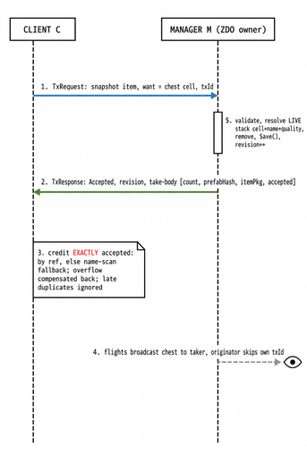
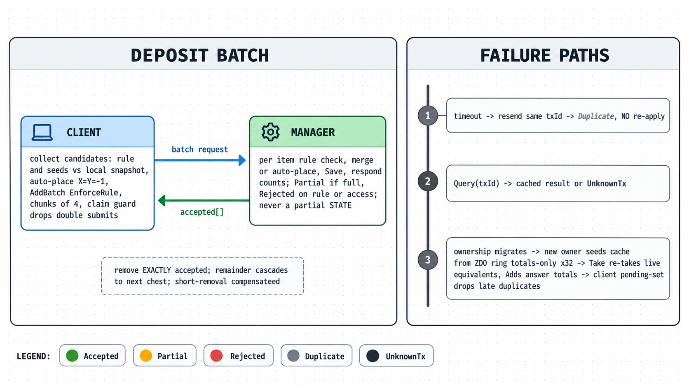
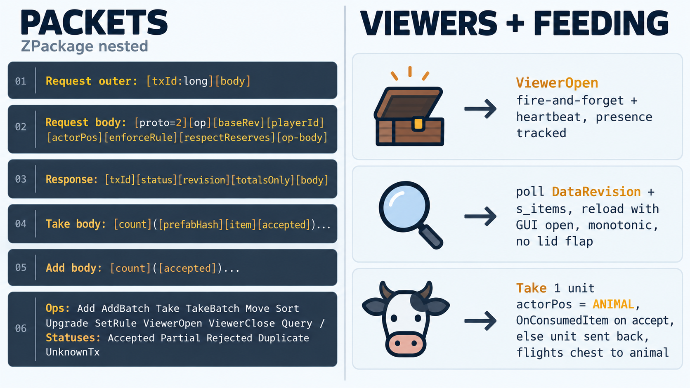

# BestAutoSort


Standalone storage mod for Valheim (GUID `dev.maks2204.bestautosort`).
Updated and tested for **Valheim 1.0.12**.

- **Shared chests:** every player can open the same chest at the same time, no lockouts
- **Quick-stack:** hotkey moves matching items into nearby storage
- **Lock and restock:** Alt + left-click cycles an item through Locked → Replenish → Nothing
- **Storage rules:** per-chest item/category filters, presets, reserves
- **Crafting and building:** materials from nearby chests within radius
- **Fuel and ingredients:** machines, cooking stations, kilns, smelters, fermenters pull from nearby chests
- **Animal feeding:** hungry tame animals fed automatically from nearby chests
- **Chest upgrades:** wooden → Reinforced / Black Metal / Grausten tiers, contents kept
- **Sort and trash:** LeftAlt + S sorts the open chest, Trash button deletes

Notes:
- Own plugin folder (`BepInEx/plugins/BestAutoSort/`), own config (`dev.maks2204.bestautosort.cfg`).
- Console command: `bestautosort`.
- All players + server must run the same version (exact-match hello gate).

> **0.6.x experimental:** the `0.6.x-Dedicated-Test` line migrates chests to
> server authority (server/host permanently owns eligible chests; remote
> clients are viewers/requesters only). The server-authority invariant is
> **not yet claimed** pending live multi-peer verification. Mode/hello gate:
> peers must match on `version` AND `auth` mode (`version;auth=N`); mismatched
> peers are rejected. Vanilla (mod-less) clients are **unsupported** for
> managed chests (view-only grant at best; local vanilla takes fork ghost
> items). Remote chest upgrade runs only via the server-mediated
> `TxOp.UpgradeRequest` contract (legacy direct-upgrade frames refused);
> see `docs/remote-upgrade-mediated.md` including its 4 documented residuals.

## Multiplayer protocol (ChestTX)

```
+----------------+
|   ONE CHEST    |
|   ONE OWNER    |  <- ZDO owner = manager, never ping-ponged
|   ONE TX       |  <- validate -> apply -> Save() -> revision -> respond
|   AT A TIME    |     (per-chest serial queue, main thread)
+----------------+
```

Details: `docs/CHEST_TX.md`.

### Actors & channels

```
+----------+  TxRequest   +----------------------+  TxResponse  +----------+
|  CLIENT  | -----------> |  CHEST ZNetView      | -----------> |  CLIENT  |
| (any peer|  (no target: |  (engine routes the  |  (targeted   | (same     |
|  incl.   |  straight to |   packet to the ZDO  |   at the     |  peer)    |
|  server) |  the owner)  |   owner = MANAGER)   |   requester) |          |
+----------+              +----------------------+              +----------+
   TxFlights (target 0 = broadcast, loopback included) ----------> EVERYBODY
   MultiUserHello (version string, exact match) -----------------> EVERYBODY
```

### Packets (`ZPackage`, nested)

| Packet | Layout |
|---|---|
| Request outer | `[txId:long]` `txId = peerId<<32 \| counter` + `[body:ZPackage]` |
| Request body | `[proto:int=2/3]` `[op:int]` `[baseRev:uint]` `[playerId:long]` `[actorPos:vec3]` `[enforceRule:bool]` `[respectReserves:bool]` `[op-body...]` (+ v3 trailing `[isTransientRetry:bool]`) |
| Response | `[txId:long]` `[status:int]` `[revision:uint]` `[totalsOnly:bool]` `[body:ZPackage]` |
| Take body | `[count:int]` then per entry `[prefabHash:int]` `[item:ZPackage]` `[accepted:int]` |
| Add body | `[count:int]` then per entry `[accepted:int]` |
| Item snapshot | `[prefabHash]` `[itemPkg]` `[amount]` `[x]` `[y]` `[maxStack]`; `itemPkg` = `ItemData.Save` (quality/variant/durability/stack/crafter/customData/world/gridPos) |
| Ops | Add / AddBatch / Take / TakeBatch / Move / Sort / Upgrade (legacy direct frames refused on managed chests) / UpgradeRequest (server-mediated, v3) / SetRule / ViewerOpen / ViewerClose / Query |
| Statuses | Accepted / Partial / Rejected / Duplicate / UnknownTx / TransientUnavailable (v3, non-terminal: retain same txId, never terminal-forget) |

### Take one stack (GUI drag)



### Deposit batch (quick-stack, per chest)



### Viewers (many GUIs, one chest) + feeding



## Install

1. Install [BepInExPack Valheim](https://thunderstore.io/c/valheim/p/denikson/BepInExPack_Valheim/)
2. Drop `BestAutoSort.dll` into `Valheim/BepInEx/plugins/BestAutoSort/`


## Build from source

```powershell
# Game path (if not D:/SteamLibrary/steamapps/common/Valheim)
$env:VALHEIM_INSTALL = "D:/SteamLibrary/steamapps/common/Valheim"

# Debug build + auto-deploy to the game
dotnet build BestAutoSort.csproj -c Debug

# Thunderstore release zip
.\package.ps1
```

See `DEV.md`.
